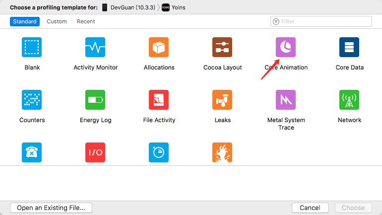
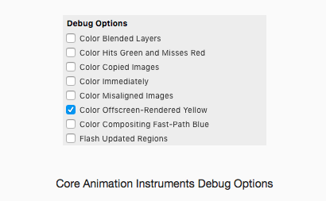
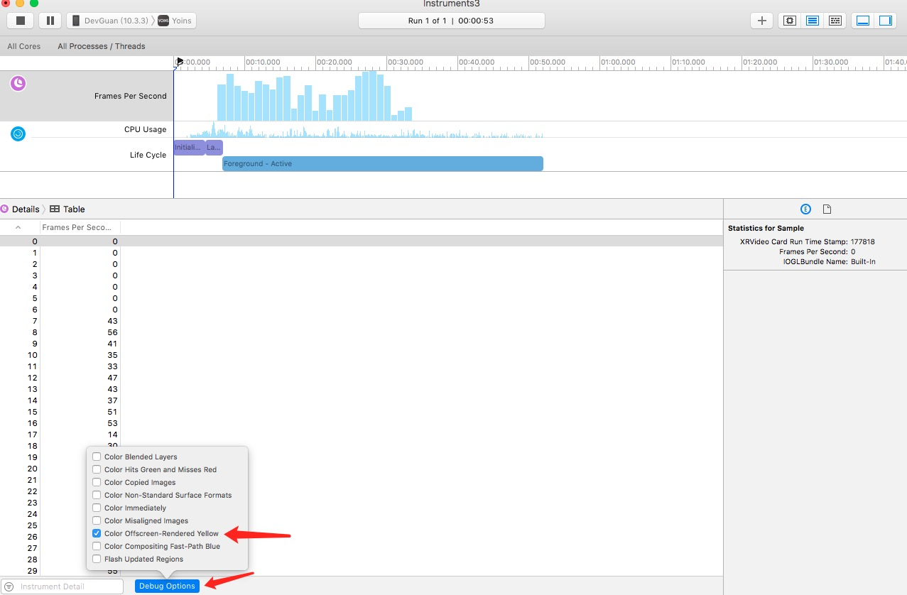
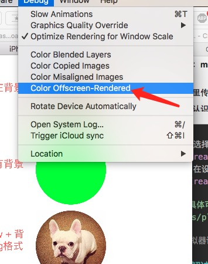
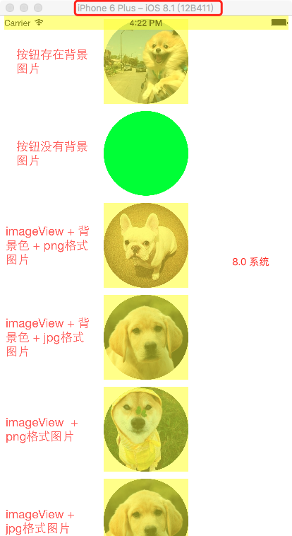
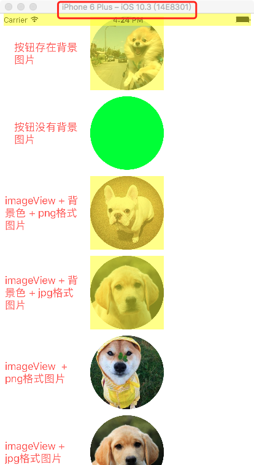

# 离屏渲染 

---

## 60FPS信仰
优秀的app,流畅很关键,用户使用60的fps的app,跟使用30的fps的app感受是完全不一样的。

### 历史

苹果官方公开的的资料里关于离屏渲染的信息最早是在 2011年的 WWDC， 在多个 session 里都提到了尽量避免会触发离屏渲染的效果，包括：mask, shadow, group opacity, edge antialiasing。

### 屏幕渲染
* OpenGL中,GPU屏幕渲染有两种方式.

	* On-Screen Rendering (`当前屏幕渲染`)
	
		指的是GPU的渲染操作是在当前用于显示的屏幕缓冲区进行.
	
	* Off-Screen Rendering (`离屏渲染`)
	
		指的是在GPU在当前屏幕缓冲区以外开辟一个缓冲区进行渲染操作.
	
* 两者关系
	* 当前屏幕渲染不需要额外创建新的缓存，也不需要开启新的上下文，相对于离屏渲染性能更好。但是受当前屏幕渲染的局限因素限制(只有自身上下文、屏幕缓存有限等)，当前屏幕渲染有些情况下的渲染解决不了的，就使用到离屏渲染。

	* 离屏渲染出现的目的在于当使用圆角，阴影，遮罩的时候，图层属性的混合体被指定为在未预合成之前不能直接在屏幕中绘制，即当主屏的还没有绘制好的时候，所以就需要屏幕外渲染，最后当主屏已经绘制完成的时候，再将离屏的内容转移至主屏上。

### 形成方式
下面的情况或操作会引发离屏渲染：

* 为图层设置遮罩（layer.mask）
* 将图层的切割属性layer.masksToBounds / view.clipsToBounds属性设置为true
* 将图层透明度layer.allowsGroupOpacity属性设置为YES和layer.opacity小于1.0
* 为图层设置阴影（layer.shadow *）。
* 为图层光栅化设置layer.shouldRasterize=true
* 具有圆角layer.cornerRadius，反锯齿layer.edgeAntialiasingMask，layer.allowsEdgeAntialiasing的图层

* 特殊的“离屏渲染”：CPU渲染。如果我们重写了drawRect方法，并且使用任何Core Graphics的技术进行了绘制操作，方法中绘制大部分情况下会导致离屏渲染，甚至仅仅是一个空的实现，基本都会涉及到CPU渲染。整个渲染过程由CPU在App内同步地完成，渲染得到的bitmap(位图)最后再交由GPU用于显示。理论上CPU渲染应该不算是标准意义上的离屏渲染，但是由于CPU自身做渲染的性能也不好，所以这种方式也是需要尽量避免的。

### 引发的问题

相比于当前屏幕渲染，离屏渲染的代价是很高的，主要体现在两个方面：

（1）创建新缓冲区

要想进行离屏渲染，首先要创建一个新的缓冲区。

（2）上下文切换

离屏渲染的整个过程，需要多次切换上下文环境：先是从当前屏幕（On-Screen）切换到离屏（Off-Screen），等到离屏渲染结束以后，将离屏缓冲区的渲染结果显示到屏幕上有需要将上下文环境从离屏切换到当前屏幕。而上下文环境的切换是要付出很大代价的。

### 如何检测

* `真机调试 `  
	显示黄色部分就是检测到离屏渲染的区域
	* 打开 调试界面
	
		
	
	* 选择 CoreAnimation
	
	*  xcode 8.2 版本在侧边设置项  
	 	
	

	
		xcode 8.3版本
		

	[具体可参考官方资料](https://developer.apple.com/videos/play/wwdc2014/419/)
	
* `模拟器调试 `
	在模拟器执行项目  通过打开 Debug -->> Color Offscrenn-Rendered  模拟器黄色部分就是检测到离屏渲染的区域
	
	
	
	
### 解决方案

实际工作中，处理离屏渲染，主要是处理圆角问题。

* 处理建议 ：
	* 当我们需要圆角效果时，可以使用一张中间透明图片蒙上去
	* 使用ShadowPath指定layer阴影效果路径
	* 使用异步进行layer渲染（Facebook开源的异步绘制框架AsyncDisplayKit）
	* 设置layer的opaque值为YES，减少复杂图层合成
	* 尽量使用不包含透明（alpha）通道的图片资源
	* 尽量设置layer的大小值为整形值
	* `直接让美工把图片切成圆角进行显示，这是效率最高的一种方案`
	* 很多情况下用户上传图片进行显示，可以让服务端处理圆角
	* 使用代码手动生成圆角Image设置到要显示的View上，利用UIBezierPath（CoreGraphics框架）画出来圆角图片


* 系统已有的优化： [测试Demo地址](https://github.com/DevGuan/0817Demo.git)

	8.0系统 Button 与 ImageView
	
	
	
	9.0以上系统 Button 与 ImageView
	
	


### 其他方案

可参照 最近正在做的模块化中的一个 UIView+YSTarget 实现逻辑，比较方便的使用imageView代替 Button,较为轻量化的同时，9.0以上避免离屏渲染问题。

[头文件](UIView+YSTarget.h)
[实现文件](UIView+YSTarget.m)

* 主要实现

	```Objective-C
	
	- (void)ys_AddTarget:(id)target action:(SEL)action{
	    self.userInteractionEnabled = YES;
	    self.target = target;
	    self.actionStr = NSStringFromSelector(action);
	}
	
	- (void)touchesEnded:(NSSet<UITouch *> *)touches withEvent:(UIEvent *)event{
	    [super touchesEnded:touches withEvent:event];
	    SEL action = NSSelectorFromString(self.actionStr);
	    
	    if ([self.target respondsToSelector:action]) {
	        IMP imp = [self.target methodForSelector:action];
	        void (*func) (id,SEL,id) = (void *)imp;
	        
	        func(self.target , action ,self);
	    }
	}
	
	```
	
* 简单使用 
	
	```Objective-C
		UIImageView *left = [[UIImageView alloc]initWithFrame:CGRectMake(0, 0, 20, 20)];
	    left.image = [UIImage imageNamed:@"header_label"];
	    [left ys_AddTarget:self action:@selector(leftNavClicked)];
	    self.navigationItem.leftBarButtonItem = [[UIBarButtonItem alloc]initWithCustomView:left];
	    
	    UIImageView *right = [[UIImageView alloc]initWithFrame:CGRectMake(0, 0, 20, 20)];
	    right.image = [UIImage imageNamed:@"header_search"];
	    [right ys_AddTarget:self action:@selector(rightNavClicked)];
	    self.navigationItem.rightBarButtonItem = [[UIBarButtonItem alloc]initWithCustomView:right];
	
	```
	

### 参考资料
 * [YYKit作者: "iOS 保持界面流畅的技巧"](http://blog.ibireme.com/2015/11/12/smooth_user_interfaces_for_ios/)
 * [离屏渲染的优化 (这篇文章很强)](http://www.jianshu.com/p/ca51c9d3575b)
 * [jim: 浅谈iOS中的视图优化](http://kuailejim.com/2016/04/22/浅谈iOS中的视图优化/)

